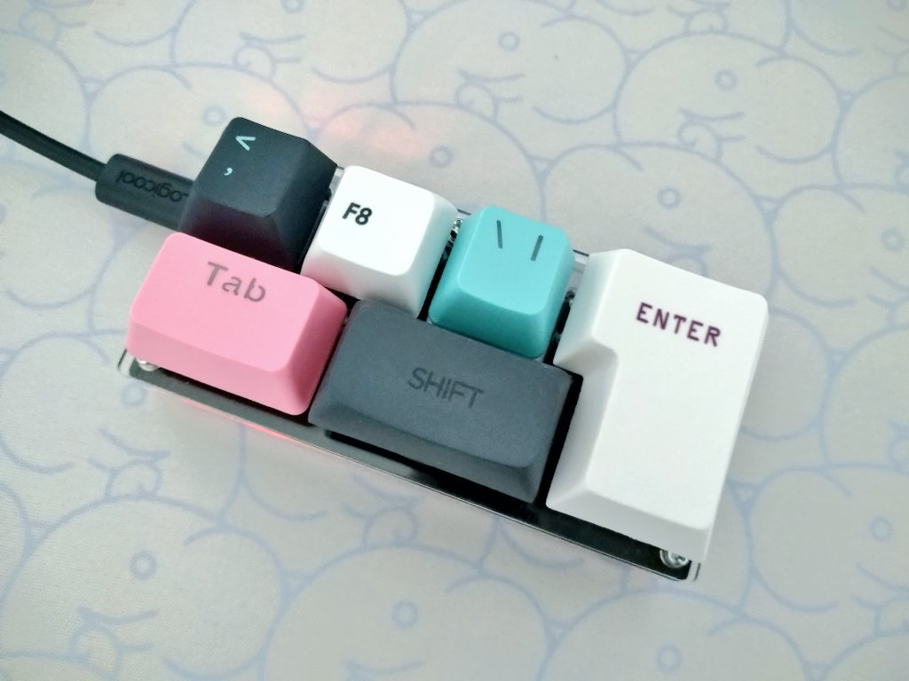

# isoginchak6

## What is isoginchak6?

ISOエンターを使った6キーのマクロパッドです。
Isoginckak6 is a 6-key macro pad with ISO enter.

 
 

## Build Guide  
https://note.com/sam1dare/n/nc1cb8ba09af6
(Japanese text only.)  

 

## License  
このプロジェクトは MITライセンスに基づいてライセンスされています。詳細については、LICENSE.txt ファイルを参照してください。  
This project is licensed under the MIT License, see the LICENSE.txt file for details.